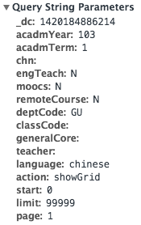

#台師大課程爬蟲

###一些細節

點開師大的[課程查詢網站](http://courseap.itc.ntnu.edu.tw/acadmOpenCourse/index.jsp)，在 Query 課程資料時觀察 GET 的資料可以發現 Query Params 很漂亮：



所以甚至也可以幫他開 API，哈哈。

製作 Query Params：

```ruby
def prepare_url_params department, year=103, term=1, language='chinese'
  {
    :acadmYear => year,
    :acadmTerm => term,
    :deptCode => department,
    :language => language,
    :action => 'showGrid',
    :start => 0,
    :limit => 99999,
    :page => 1
  }
end
```

RestClient 的 GET：
```ruby
r = RestClient.get url, :params => prepare_url_params(dep_code)
```
詳情就請見 `spider.rb`，另外 `departments.json` 是定義系所的代碼。

應該是截止目前寫起來最輕鬆的課程爬蟲了，歡呼 XDD。